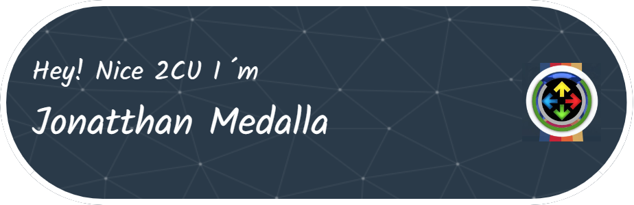

#  Bienvenid@ al Github de TryH4rdCode

Hi 👋 My name is Jonatthan Medalla
==================================
tambien conocido en redes como TryH4rdCode
------------------------------------------

Soy un estudiante de segundo año de Ingeniería en Informática y todos los días estoy aprendiendo algo nuevo

* 🌍  I'm based in Santiago de Chile
* ✉️  You can contact me at [jonatthan.medalla@gmail.com](mailto:jonatthan.medalla@gmail.com)
* 🧠  I'm learning Javascrip

### Skills

### Socials

 <a href="https://www.github.com/Tryh4rdCode" target="_blank" rel="noreferrer"> <picture> <source media="(prefers-color-scheme: dark)" srcset="https://raw.githubusercontent.com/danielcranney/readme-generator/main/public/icons/socials/github-dark.svg" /> <source media="(prefers-color-scheme: light)" srcset="https://raw.githubusercontent.com/danielcranney/readme-generator/main/public/icons/socials/github.svg" />  </picture> </a> <a href="http://www.instagram.com/jonatthanmedallaaliste/" target="_blank" rel="noreferrer"> <picture> <source media="(prefers-color-scheme: dark)" srcset="undefined" /> <source media="(prefers-color-scheme: light)" srcset="https://raw.githubusercontent.com/danielcranney/readme-generator/main/public/icons/socials/instagram.svg" />  </picture> </a> <a href="https://www.linkedin.com/in/jonatthan-medalla-aliste-b0672a249/" target="_blank" rel="noreferrer"> <picture> <source media="(prefers-color-scheme: dark)" srcset="https://raw.githubusercontent.com/danielcranney/readme-generator/main/public/icons/socials/linkedin-dark.svg" /> <source media="(prefers-color-scheme: light)" srcset="https://raw.githubusercontent.com/danielcranney/readme-generator/main/public/icons/socials/linkedin.svg" />  </picture> </a> <a href="https://www.x.com/TryH4rdGame" target="_blank" rel="noreferrer"> <picture> <source media="(prefers-color-scheme: dark)" srcset="https://raw.githubusercontent.com/danielcranney/readme-generator/main/public/icons/socials/twitter-dark.svg" /> <source media="(prefers-color-scheme: light)" srcset="https://raw.githubusercontent.com/danielcranney/readme-generator/main/public/icons/socials/twitter.svg" />  </picture> </a>

### Badges